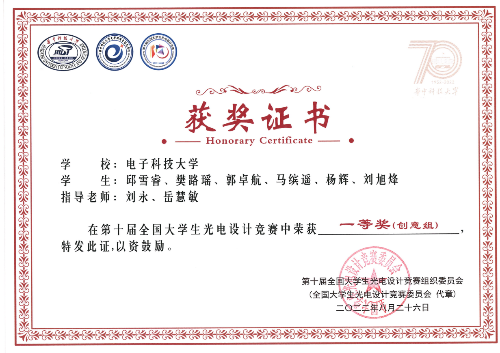
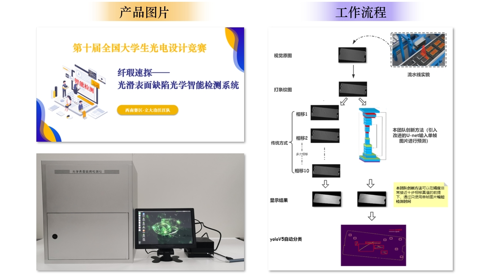
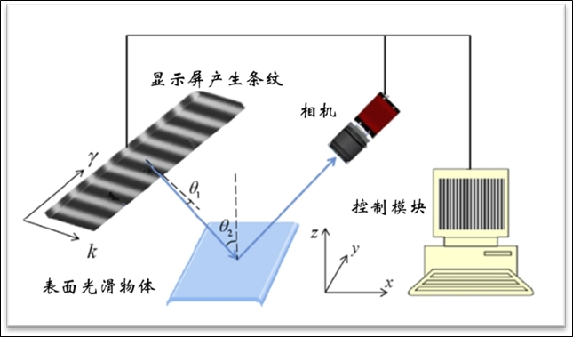

# Structured-Light-Defect-Inspection-System
## First Prize of the Tenth National Optoelectronics Design Competition

## Work flow

## Simple model

# How to Run
First clone the repository.
~~~
git clone https://github.com/bollossom/Structured-Light-Defect-Inspection-System.git
~~~

# Training  Defect-Inspection
Our dataset can be found in 
~~~
link：https://pan.baidu.com/s/1DSBqXN8GlXzHd2p8neCqJg 
code：ssdj
~~~
# Training  object-detection
Our dataset can be found in 
~~~
link：https://pan.baidu.com/s/1Q5dcS_2IZ2ziKsXAzY-VFw 
code：e18o
~~~
## Introduction video of defect detection instrument work
~~~
link：https://pan.baidu.com/s/1z7dUUt_maohvi7fFRaIVZQ 
code：eqaj
~~~

